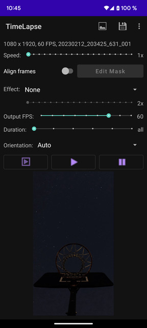
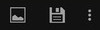
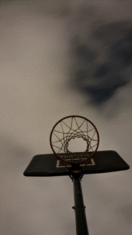
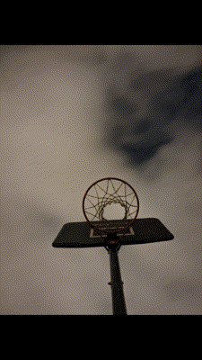

# TimeLapse

Create timelapse videos from another video or a series of photos (the photos will be sorted alphabetically).

* [Main screen](#main-screen)
  * [Toolbar](#toolbar)
  * [Parameters](#parameters)
  * [Media](#media)
* [Examples](#examples)
  * [Smooth](#smooth)
  * [Transition](#transition)
  * [Other](#other)

## Main screen

### Toolbar

In order:
* Open a video file
* Save the generated video
* ... contains
  * Open a series of images
  * Open an images folder
  * Save the last frame a image (full size)
  * Settings

### Parameters

* Speed: allow to sub-sample input frames (keep only one of "speed" frames). Example: 3x means use only one of 3 frames. 1x means use all frames.
* Align: allow to align frame (for still). If needed you can create a mask.
* Effect: You can select one from the list. Some effect have an extra parameter. For example for Average, 2x means it will output an average of 2 consecutive frames in a sliding window. Ex: 0 and 1, then 1 and 2 ... . It's better to experiment.
* Output FPS: by default it will match the input but can be changed.
* Duration: you can generate a smaller video to test it before creating the full one.
* Orientation: auto (landscape or portrait, depends on the input), landscape or portrait

### Media

In order:
* Play the original video (don't works if the input is a series of images)
* Play the generated video (it will generate it if needed)
* Stop the player

## Examples

### Smooth

Original on left vs smooth 10x on right.

### Transition

Input images
1 | 2 | 3 | 4
-- | -- | -- | --
 |  |  | 

Crop | No Crop
-- | --
 | 

### Other

Normal | Endless Lightest Pixels
-- | --
 | 
