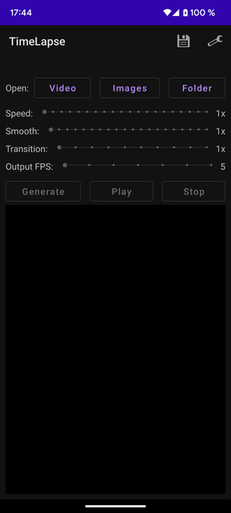
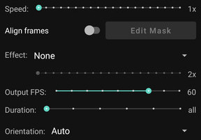
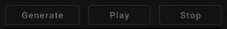
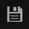
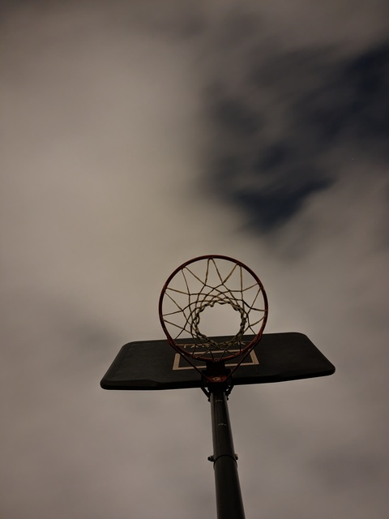
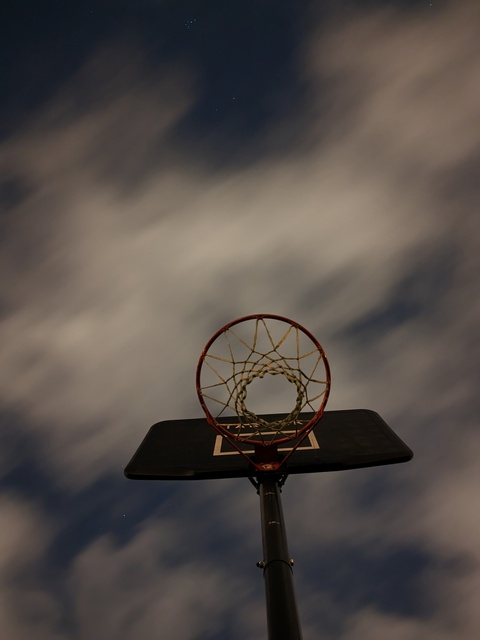

# TimeLapse

Create timelapse videos from another video or a series of photos (the photos will be sorted alphabetically).

* [Main screen](#main-screen)
  * [Open](#open)
  * [Parameters](#parameters)
  * [Generate and preview](#generate-and-preview)
  * [Save](#save)
* [Examples](#examples)
  * [Smooth](#smooth)
  * [Transition](#transition)

## Main screen

### Open

Allow to open a videso a series of photos or a photo folder.

### Parameters

* Speed: allow to keep only one of "speed" frames. Example: 3x means use only one of 3 frames. 1x means use all frames.
* Smooth: allow to do the moving average of N frames. 1x means disabled.
* Transition: make a linear transition between 2 consecutive frames. 1x means disabled
* Output FPS

### Generate and preview

Generate the video based on the current parametes.
Once generated the Play / Stop buttons will be enabled and allow to see the result.

### Save

Allow to save the current generated video to Gallery.

## Examples

### Smooth

Original | Smooth 10x
-- | --
 | 

### Transition

Input images
1 | 2 | 3 | 4
-- | -- | -- | --
 |  |  | 

Crop | No Crop
-- | --
 | 
